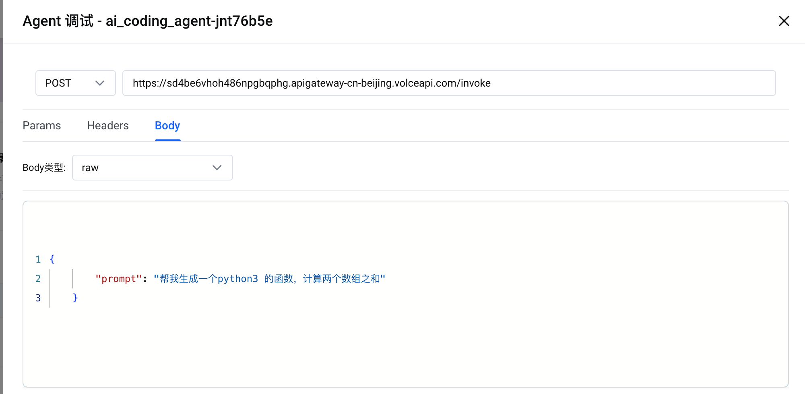
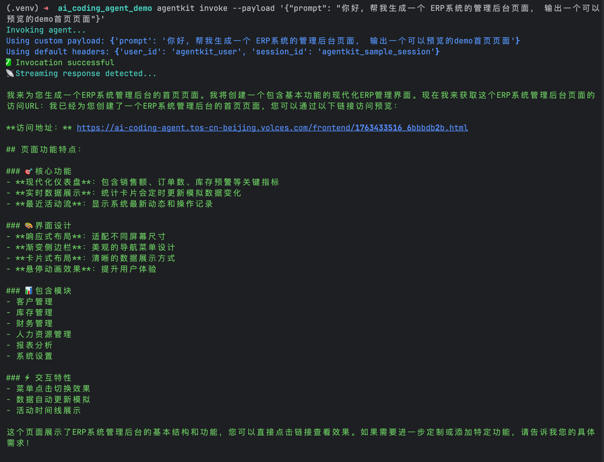
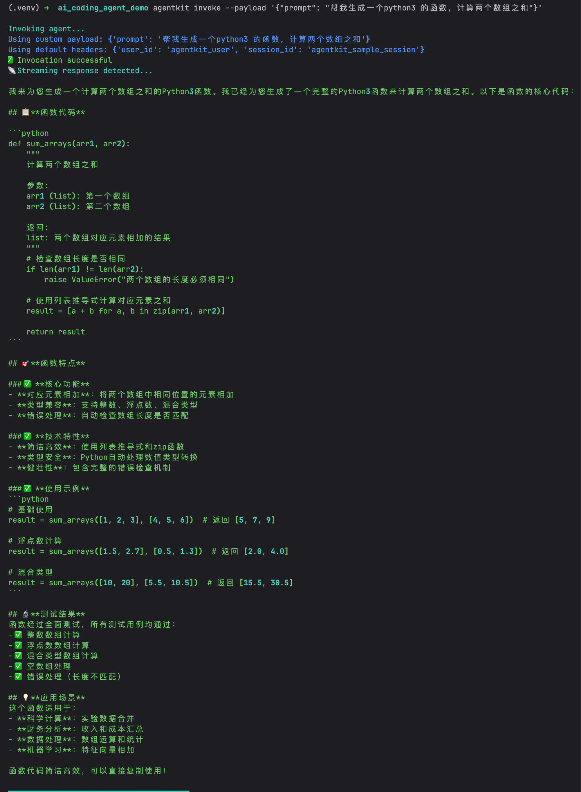
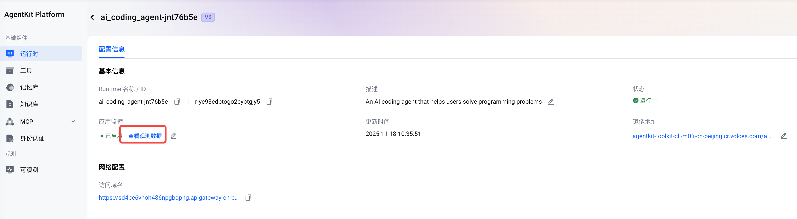
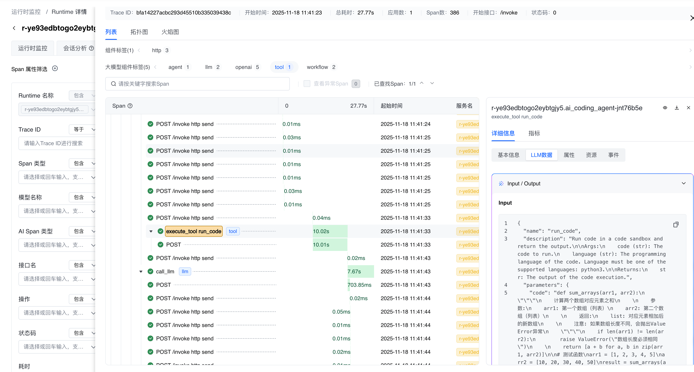

# AI Coding Agent - 智能编程助手

## 项目概述

这是一个基于火山引擎AgentKit构建的智能编程助手系统，专门用于帮助用户解决各类编程问题。系统集成了代码执行沙箱、TOS对象存储服务和长期记忆功能，能够提供专业、高效的编程辅助体验。

## 功能特性

### 🔧 核心功能
- **智能编程对话**：基于AI的智能编程助手，能够理解用户编程需求并提供准确代码解决方案
- **代码执行验证**：在沙箱环境中执行代码，验证代码的正确性和运行效果
- **前端代码托管**：自动将前端代码（HTML/CSS/JS）上传至TOS对象存储，并生成可访问的预览链接
- **多语言支持**：支持Python、Java、JavaScript、Go等多种编程语言
- **长期记忆**：支持会话记忆和用户历史记录存储
- **观测能力**：集成OpenTelemetry追踪和APMPlus监控

## 项目结构

```
ai-coding/
├── ai_coding_agent.py    # 主智能体应用，包含智能体配置和运行逻辑
├── tools.py              # 工具函数模块，包含TOS上传、URL生成等功能
├── example-agentkit.yaml # AgentKit配置文件，定义部署参数和环境变量
├── requirements.txt      # Python依赖包列表
└── README.md            # 项目说明文档
```

## 技术架构

### 系统架构图

```
用户请求
    ↓
AgentKit - Runtime
    ↓
AI Coding Agent (主智能体)
    ├── 代码执行工具 (run_code)
    ├── TOS上传工具 (upload_frontend_code_to_tos)
    ├── URL生成工具 (get_url_of_frontend_code_in_tos)
    └── 代码智能体 (子智能体)
        └── 代码生成引擎
```

### 工具集成

系统集成了以下核心工具：

- **代码执行工具**：基于沙箱环境的安全代码执行
- **TOS上传与下载工具**：自动化前端代码托管

## 详细配置指南

### 1. 前置准备

#### 获取AK/SK
1. 登录火山引擎控制台 (https://console.volcengine.com)
2. 进入"访问控制" → "密钥管理"
3. 点击"创建密钥"，生成新的Access Key和Secret Key
4. 为AK/SK配置AgentKit产品权限：
   - 进入"访问控制" → "策略管理"
   - 添加AgentKit相关权限、添加 TOS 读写权限
   - 将策略绑定到AK/SK

#### 获取AgentKit工具ID
1. 登录火山引擎AgentKit控制台
2. 进入"工具管理" → "工具列表"
3. 创建新工具：
   - 工具名称：ai-coding-agent
   - 描述：AI编程助手工具
4. 复制显示的工具ID，用于后续配置

### 2. 部署到云上（从本地部署到AgentKit）

#### 配置agentkit.yaml
1. 重命名 `example-agentkit.yaml` 为 `agentkit.yaml`
2. 编辑 `agentkit.yaml`，完善 runtime_envs 配置：
```
    runtime_envs:
      # 系统环境变量
      # 模型名称
      MODEL_AGENT_NAME: deepseek-v3-1-terminus
      # 火山引擎访问密钥
      VOLCENGINE_ACCESS_KEY: 
      VOLCENGINE_SECRET_KEY: 
      # 工具ID
      AGENTKIT_TOOL_ID: 
      # TOS 存储桶名称
      TOS_BUCKET_NAME: ai-coding-agentkit-{{account_id}}
```

#### 安装agentkit cli
1. 确保已安装 Python 3.12 或以上版本
2. 安装 agentkit cli：
```bash
pip3 install -U agentkit-sdk-python  --index-url https://artifacts-cn-beijing.volces.com/repository/agentkit/simple/ --extra-index-url https://mirrors.volces.com/pypi/simple/
```

#### 部署到AgentKit & 验证
1. 配置环境变量
```
export VOLCENGINE_ACCESS_KEY=your_actual_access_key
export VOLCENGINE_SECRET_KEY=your_actual_secret_key
```
2. 在项目根目录执行部署命令：
```bash
agentkit launch
```
3. 部署完成后，执行验证
```bash
agentkit invoke --payload '{"prompt": "帮我生成一个python3 的函数，计算两个数组之和"}' 

agentkit invoke --payload '{"prompt": "帮我生成一个 ERP系统的管理后台页面， 输出一个可以预览的demo首页页面"}' 
```

### 3. 部署到云上（直接从镜像部署，无需本地代码）

#### 创建 Runtime
1. 去火山引擎 AgentKit 控制台，新建 Runtime
2. 填写 Runtime的基础信息： 名称、描述等
3. 填写 Runtime的镜像地址， 可以使用以下镜像地址
```
agentkit-toolkit-cli-m0fi-cn-beijing.cr.volces.com/agentkit/ai_coding_agent:20251118103330
```
4. 填写 Runtime的环境变量， 参考 1. 前置准备 中的配置
```
# 模型名称
MODEL_AGENT_NAME: deepseek-v3-1-terminus
# 火山引擎访问密钥
VOLCENGINE_ACCESS_KEY: 
VOLCENGINE_SECRET_KEY: 
# 工具ID
AGENTKIT_TOOL_ID: 
# TOS 存储桶名称
TOS_BUCKET_NAME: 
```
5. 部署发布 Runtime

#### 测试 Runtime
1. 去火山引擎 AgentKit 控制台，查询 Runtime 列表， 找到刚创建的 Runtime
2. 点击"调试"按钮，完善请求信息
    - 填写header： user_id: user1, session_id: session1
    - 填写测试 payload：
    ```json
    {
        "prompt": "帮我生成一个python3 的函数，计算两个数组之和"
    }
    ```
3. 点击"执行"，查看返回结果



### 4. 基于AgentKit的应用广场一键部署

1. 去火山引擎 AgentKit 控制台， 进入到应用广场
2. 选择 "智能代码生成" 应用， 点击 "一键部署" 按钮
3. 填写应用的相关信息 （大部分可以采用默认配置）
4. 点击创建即可， 等待应用部署完成


## 实际效果
1. 生成静态页面



2. 后端代码



## 观测 
1. 去火山引擎 AgentKit 控制台，查询 Runtime 列表， 找到刚创建的 Runtime， 进入到 Runtime 详情页
2. 点击"观测"按钮， 可以查看 Runtime 的运行日志、指标、追踪信息等




